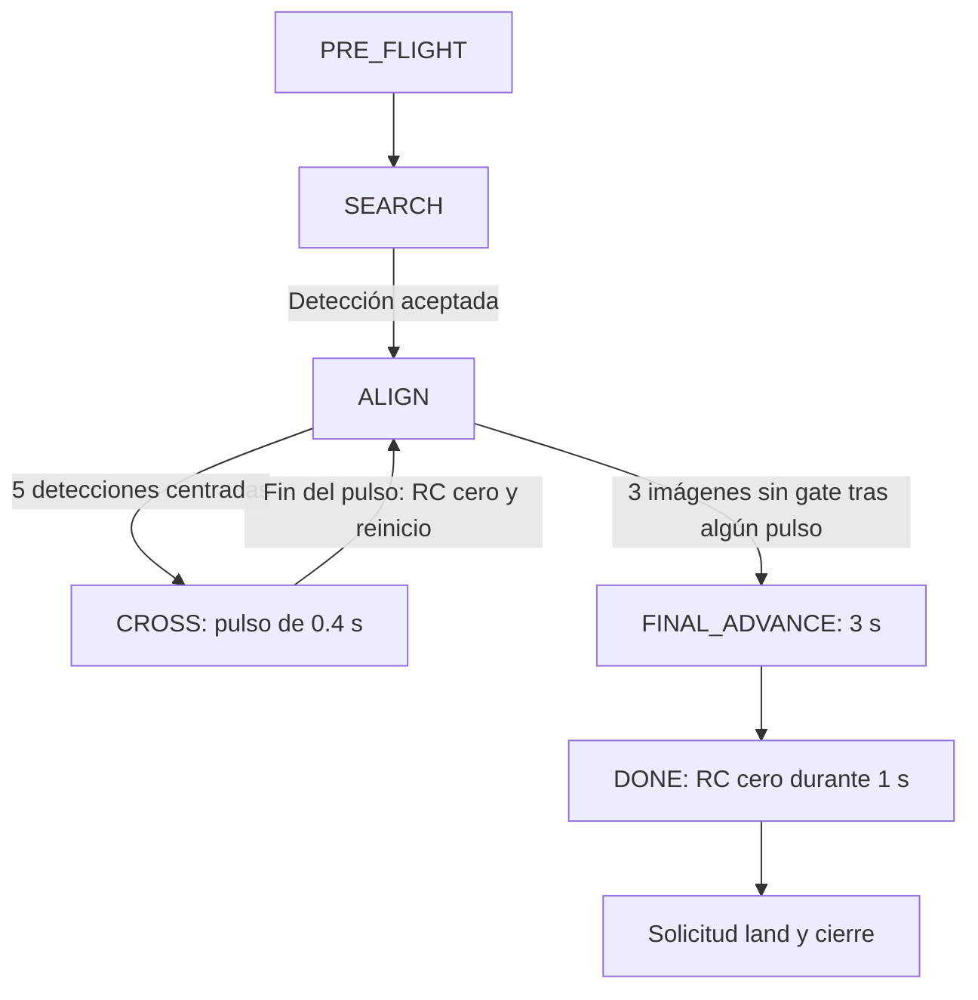

# Documentación técnica

## Alcance y fuentes

Este documento describe la implementación presente en `main.py`, `config.py`, `gate_detector.py`, `controller.py`, `video_source.py`, los scripts auxiliares y `tests/`. Las instrucciones de instalación y ejecución están en [README.md](README.md).

Las decisiones descritas se deducen de las estructuras, operaciones y comentarios del código. No se atribuyen al proyecto resultados físicos, precisión medida ni requisitos dimensionales del marco que la implementación no verifica. La documentación anterior de `docs/` se conserva, pero no constituye la fuente de verdad de este comportamiento.

## 1. Captura y representación de datos

`VideoSource` selecciona una fuente:

| Fuente | Apertura | Lectura |
|---|---|---|
| Archivo | `cv2.VideoCapture(video)` | `capture.read()`; lectura fallida marca EOF. |
| Webcam | `cv2.VideoCapture(webcam)` | `capture.read()`; lectura fallida no marca EOF. |
| Tello | Importación diferida de `Tello`, `connect()`, `streamon()` | `get_frame_read(with_queue=True, max_queue_len=1)` y `reader.frame`. |

La rama Tello convierte RGB a BGR antes del procesamiento. Esta suposición está explícita en el código y asociada a la versión fijada de DJITelloPy. Las fuentes OpenCV ya se manejan como BGR.

`valid_frame()` exige una matriz no vacía, con tres dimensiones y tres canales. `resize_frame()` fija el ancho en `PROCESS_WIDTH = 640` y conserva la proporción, redondeando la altura. Por ello, los umbrales de área y tamaño pertenecen a la imagen procesada, no a la resolución original.

La cola de longitud uno busca evitar acumulación de imágenes antiguas. No existe comparación de contenido para comprobar que dos imágenes sean diferentes: la aplicación considera fresca una lectura no nula. `frame_number` cuenta lecturas válidas.

## 2. Segmentación y selección del marco

`GateDetector.detect()` realiza:

1. Validación básica del frame.
2. Conversión BGR → HSV.
3. Umbral por `cv2.inRange()` con `HSV_MIN = (100,80,60)` y `HSV_MAX = (130,255,255)`.
4. Apertura morfológica para quitar estructuras pequeñas y cierre para unir interrupciones pequeñas. Kernel actual: 3 × 3; una apertura y dos cierres.
5. Extracción de contornos con `RETR_TREE` y `CHAIN_APPROX_SIMPLE`.
6. Evaluación únicamente de contornos exteriores.
7. Selección de un candidato por puntuación.

Los filtros actuales son:

| Criterio | Implementación |
|---|---|
| Área exterior | Al menos 1500 píxeles cuadrados. |
| Tamaño de caja | Ancho y alto de al menos 45 píxeles. |
| Proporción | Con tolerancia 0.45, exige `0.55 <= w/h <= 1/0.55`. |
| Rectangularidad | `area/(w*h) >= 0.60`. |
| Aproximación poligonal | Epsilon igual a 0.03 del perímetro; entre 4 y 6 vértices; polígono convexo. |
| Hueco | Con `REQUIRE_HOLE = True`, el mayor contorno hijo debe ocupar entre 0.25 y 0.95 del área exterior. |

No se suman todos los huecos: se toma el de mayor área entre los hijos examinados.

El centro se obtiene de los momentos del contorno exterior:

```text
cx = m10 / m00
cy = m01 / m00
```

Se descartan momentos con `m00 = 0`. Este centro no es una estimación tridimensional ni una reconstrucción de partes ocultas.

Para cada candidato:

```text
ratio = w / h
confidence = rectangularity * min(ratio, 1 / ratio)
center_distance = hypot((cx - W/2)/W, (cy - H/2)/H)
score = area * confidence / (1 + center_distance)
```

Se conserva el candidato con mayor `score`. La `confidence` almacenada es una medida geométrica heurística, no una probabilidad calibrada; tampoco es exactamente el `score` de selección.

`GateDetection` contiene `detected`, `center_x`, `center_y`, `bbox=(x,y,w,h)`, `area`, `width_ratio=w/W` y `confidence`. La función devuelve además la máscara binaria. Sin candidato devuelve los valores predeterminados; con entrada inválida, la máscara es `None`.

## 3. Error visual y referencia desplazada

La implementación actual de `normalized_error()` usa:

```text
target_y = H * 0.25
ex = (cx - W/2) / (W/2)
ey = (target_y - cy) / (H/2)
```

Un error horizontal positivo ordena derecha; uno vertical positivo ordena subir. Un gate por debajo de la referencia produce error vertical negativo y corrección hacia abajo.

El punto deseado es `(W/2, H/4)`. Para una imagen de 640 × 480, corresponde a `(320,120)`. El valor 0.25 está hardcodeado, no se obtiene de calibración intrínseca o extrínseca de la cámara. El código no justifica físicamente ese desplazamiento.

Al desplazar la referencia, el error vertical ya no tiene el intervalo simétrico usual alrededor del centro: en los extremos de la imagen se aproxima a +0.5 y -1.5. Sin detección se devuelve `(0,0)`; esos ceros no prueban alineación.

`draw_debug()` todavía dibuja el marcador, el rectángulo de tolerancia y la línea de referencia alrededor de `(W/2,H/2)`. El HUD y el controlador usan referencias diferentes. El indicador denominado `score` en el HUD muestra `detection.confidence`.

## 4. Conversión del error a comandos

`PController` mantiene dos valores suavizados, uno por eje. Por cada eje:

```text
limit = min(maximum_del_eje, MAX_RC_SPEED, 100)

Si abs(error) <= deadband:
    smoothed = 0
En otro caso:
    target = clip(Kp * error, -limit, limit)
    si target cambia de signo respecto a smoothed:
        smoothed = 0
    smoothed = alpha * target + (1 - alpha) * smoothed

command = entero_redondeado_y_limitado(smoothed)
```

La zona muerta borra la memoria inmediatamente para no conservar correcciones pequeñas dentro del margen. El reinicio por cambio de signo evita arrastrar la corrección anterior en dirección opuesta.

Valores actuales:

| Parámetro | Valor |
|---|---:|
| `KP_X`, `KP_Y` | 80 |
| `MAX_LR_SPEED`, `MAX_UD_SPEED` | 30 |
| `MAX_RC_SPEED` | 30 |
| `DEADBAND_X`, `DEADBAND_Y` | 0.08 |
| `EMA_ALPHA` | 1.0 |

Con alpha igual a uno, el suavizado está efectivamente desactivado. Por ejemplo, error horizontal 0.20 produce objetivo 16, mientras que error 0.60 produce 48 y queda limitado a 30. No hay término integral, derivativo ni mínimo de movimiento.

La zona muerta de 0.08 corresponde al 4 % de la dimensión total de la imagen a cada lado de la referencia. Para 640 × 480: ±25.6 píxeles horizontales y ±19.2 verticales.

## 5. Identidad del objetivo y estabilidad

`Navigation.same_target()` compara:

- Distancia entre centros dividida por la diagonal de la imagen: máximo 0.15.
- Cociente entre el ancho mayor y menor: máximo 1.5.

No asigna identificadores persistentes ni usa un tracker. La comparación considera la detección anterior; después de una pérdida se borra esa referencia.

`DETECTED_FRAMES = 1` permite corregir desde la primera detección aceptada. `ALIGNED_FRAMES = 5` exige ambos errores dentro de sus márgenes durante cinco detecciones aceptadas consecutivas antes del pulso.

Una detección no alineada reinicia `aligned_frames`. Una pérdida o un salto de objetivo reinicia también la estabilidad y el controlador. Una iteración sin frame, fuera de los avances temporizados, pone RC cero y reinicia el controlador, pero no incrementa `lost_frames` ni borra por sí sola todos los contadores de navegación. Por tanto, cinco detecciones no equivalen necesariamente a cinco iteraciones contiguas del bucle.

## 6. Máquina de estados

| Estado | Acción y salida |
|---|---|
| `PRE_FLIGHT` | Comprobaciones y espera del resultado de despegue. El cálculo de navegación aún no corrige. |
| `SEARCH` | Espera el objetivo. No gira ni realiza búsqueda espacial. Una detección suficientemente estable conduce a `ALIGN`. |
| `ALIGN` | Correcciones lateral/vertical según etapa y confirmación de centrado. |
| `APPROACH` | En la etapa `approach`, avanza con correcciones; vuelve a alinear si excede la tolerancia multiplicada por 1.5. |
| `CROSS` | Pulso recto sin corrección durante `ADVANCE_PULSE_SECONDS`. Después vuelve a `ALIGN`. |
| `FINAL_ADVANCE` | Avance recto adicional, una sola vez; al finalizar pasa a `DONE`. |
| `DONE` | RC cero, espera final y cierre con solicitud de aterrizaje. |
| `EMERGENCY` | Aborto lógico por fallo o parada manual; el cierre intenta aterrizar. No representa un comando de corte de motores. |

### Secuencia full



La etapa `full` entra directamente de `ALIGN` a `CROSS`: no exige `CLOSE_WIDTH_RATIO` ni pasa por `APPROACH`. El pulso devuelve `(0,CROSS_SPEED,0,0)` con `CROSS_SPEED = 30`.

Cuando acaba un pulso se activa `has_advanced`, que permanece verdadero durante la misión. Posteriormente, tres imágenes consecutivas sin detección pueden iniciar `FINAL_ADVANCE`, no solamente las imágenes inmediatamente posteriores al pulso. La comprobación de pérdida prolongada se evalúa primero y puede abortar antes.

Durante `CROSS` y `FINAL_ADVANCE`, las detecciones no modifican las órdenes ni los contadores de pérdida. Incluso si reaparece el gate durante el avance final, el temporizador continúa. La finalización significa que terminó esa maniobra programada, no que se midió el paso por el plano del marco.

Las etapas `hover`, `horizontal` y `align` retornan antes de la transición a avance. `approach` utiliza `APPROACH_SPEED = 8`, limita el avance por `width_ratio >= 0.60` y conserva correcciones.

### Parámetros activos y remanentes

| Parámetro | Uso actual |
|---|---|
| `ADVANCE_PULSE_SECONDS = 0.4` | Duración de cada pulso. |
| `FINAL_ADVANCE_SECONDS = 3.0` | Duración del avance final tras pérdida. |
| `DONE_HOVER_SECONDS = 1.0` | Espera con RC cero antes del cierre normal. |
| `CROSS_DURATION = 4.0` | Se valida, pero ya no determina duración ni vencimiento de las órdenes de avance. |
| `CROSS_STABLE_FRAMES = 8` | Se valida, pero ya no condiciona la transición actual a cruce. |
| `close_frames` | Se calcula y reinicia; no decide la transición en `full`. |
| `CLOSE_WIDTH_RATIO = 0.60` | Detiene avance en etapa `approach`; no confirma distancia ni cruce. |

## 7. Coordinación, tiempo y comunicación

`run()` calcula:

```python
dry_run = cfg.DRY_RUN or args.dry_run or source.is_local
```

Así, las fuentes locales nunca construyen un Tello y el modo sin vuelo no crea `FlightGuard`. Un Tello en modo sin vuelo sí conecta y transmite video.

En vuelo real, el inicio exige batería de al menos 40 %, una imagen válida y renovación del objeto de estado de telemetría dentro de 3 segundos. El despegue se ejecuta en un hilo para no bloquear completamente la interfaz. Tras su confirmación comienza `Navigation`, se inicia el guard y se esperan 2 segundos con RC cero.

Hay dos lazos principales:

- El bucle de visión intenta trabajar a `CONTROL_HZ = 20` para Tello/webcam; procesa, calcula, muestra y publica el último comando.
- El hilo de `FlightGuard` intenta enviar ese comando cada 1/20 s y comprueba salud y vencimiento.

Estos valores son frecuencias objetivo, no garantías de tiempo real. Las operaciones de captura, GUI y red pueden introducir retrasos. El estado se imprime con `HUD_LOG_INTERVAL = 1`, solamente en iteraciones con imagen; no es un comando al dron.

Para archivos, `Navigation` utiliza tiempo de contenido `frame_number/fps`. La ejecución con ventanas se regula por los FPS del archivo; con `--headless` se elimina la espera. El watchdog, los tiempos de captura y la telemetría emplean reloj monotónico real.

### Vigencia y parada

`FlightGuard.submit()` limita los cuatro canales y asigna un vencimiento de 0.5 segundos. Para pulsos, el vencimiento se limita además al final del pulso más un período de control.

El guard detecta batería inferior a 25 %, falta de renovación de telemetría durante más de 3 segundos o expiración del comando. Ante fallo intenta RC cero y `land()`. La renovación de telemetría se reconoce por identidad del diccionario, una dependencia explícita de cómo DJITelloPy actualiza el estado.

El bucle principal verifica falta de imagen durante más de 1 segundo, fallo del guard y otras excepciones. Durante un avance mantiene el temporizador aun sin frame nuevo, hasta que intervenga el timeout de video. Fuera de esos estados, una lectura ausente produce RC cero; no se mantiene brevemente el comando anterior.

Otros límites son 15 segundos para obtener la primera imagen, 20 segundos sin detección estable y 60 segundos de misión evaluados por `Navigation.update()`. Durante la pausa de estabilización se refresca `last_seen`. El límite de misión empieza al iniciar la navegación, no al abrir el proceso.

El cierre intenta aterrizar si existe guard o se intentó despegar, libera captura, detiene lector, solicita `streamoff()` y termina el objeto Tello. Cada recurso se intenta cerrar aunque falle otro. No hay garantía de entrega física de órdenes.

## 8. Datos registrados y diagnóstico

El CSV guarda una fila por lectura válida, con órdenes calculadas por el bucle principal. No es un registro de cada envío del hilo RC ni de velocidad física.

| Campo | Significado |
|---|---|
| `time` | Tiempo monotónico para cámara/Tello; tiempo de contenido para archivo. No es fecha/hora. |
| `state` | Estado lógico de navegación. |
| `detected` | Resultado booleano del detector para esa imagen. |
| `error_x,error_y` | Últimos errores calculados; pueden seguir inicializados durante preflight/estabilización. |
| `lr,fb,ud,yaw` | Orden calculada, en unidades RC. |
| `width_ratio` | Ancho de caja dividido por ancho de imagen. |

`State=ALIGN` indica fase de corrección, no alineación ya lograda. `rc=(0,0,0,0)` puede indicar tolerancia satisfecha, falta de frame, falta de objetivo, estabilización o finalización. Los logs actuales no etiquetan cada una de estas causas.

El FPS del HUD es un promedio de frames procesados sobre tiempo transcurrido, no una medición directa de latencia.

## 9. Scripts auxiliares y pruebas

`hsv_calibration.main()` aplica solamente el filtro de color para ajustar sliders: no reproduce todos los filtros geométricos y morfológicos de `GateDetector`. Ver una buena máscara allí no garantiza aceptación final del marco.

`samples.generate_sample.generate()` dibuja un marco verde en 240 imágenes, desplaza su centro horizontal y aumenta su tamaño mediante interpolación. La secuencia no responde a los comandos calculados: es reproducción abierta, no simulación dinámica del dron.

`test.py` conecta al Tello y muestra el stream en `Principal` hasta pulsar `q`. No utiliza `VideoSource`, no convierte explícitamente RGB a BGR, no llama a `takeoff()` y ejecuta acciones en el nivel superior del módulo. No debe confundirse con los tests de `tests/`.

Durante esta revisión se ejecutó:

```powershell
.\.venv\Scripts\python.exe -B -m unittest discover -s tests -v
```

Resultado: 36 pruebas, 30 correctas y 6 fallidas. Los fallos observados:

| Prueba de test_detector.py | Diferencia relevante con la implementación |
|---|---|
| `test_center_and_mask` | Imagen verde frente a umbral azul. |
| `test_moderate_perspective` | Imagen verde frente a umbral azul. |
| `test_normalized_error_and_signs` | Espera referencia vertical H/2; el código usa H/4. |
| `test_local_video_forces_dry_run_and_reaches_done` | Video verde y expectativa del flujo anterior con APPROACH y DONE. |
| `test_align_approach_cross_done` | Centros de prueba y transición esperada corresponden al flujo anterior. |
| `test_loss_stops_immediately_and_reacquires` | Espera APPROACH con datos que ya no satisfacen la referencia actual. |

Las pruebas de pulsos sustituyen `normalized_error()` con resultados simulados en varios escenarios. Comprueban transiciones y órdenes, pero no validan la referencia visual real ni la percepción de un marco físico. No se alteró código para hacer pasar estas pruebas.

## 10. Decisiones observables y límites

La separación de percepción, control, navegación y comunicación permite probar estados sin hardware. La elección de HSV y contornos produce reglas explícitas, dependientes de iluminación y geometría. La normalización escala el error con la imagen, pero no lo convierte a metros.

El control proporcional es sencillo y limitado por saturación; no compensa por sí solo perturbaciones persistentes. El avance por pulsos intercala control visual y avance abierto. Al terminar un pulso se envía cero, pero no se verifica mediante telemetría que el dron se haya detenido antes de continuar.

El programa no incorpora calibración de cámara, reconstrucción 3D, medidas del cuerpo del dron, estimación métrica de distancia, confirmación del plano cruzado ni sensores para evitar colisiones. No se puede deducir cuánto avanzará a partir de RC 30 durante 0.4 o 3 segundos sin medición adicional.

La transición a avance final es una regla por pérdida visual después de algún pulso, no evidencia de cruce. Un resultado `DONE` no debe presentarse como éxito físico demostrado. En la revisión documental no se ejecutó vuelo real y las pruebas automatizadas no sustituyen esa validación.

