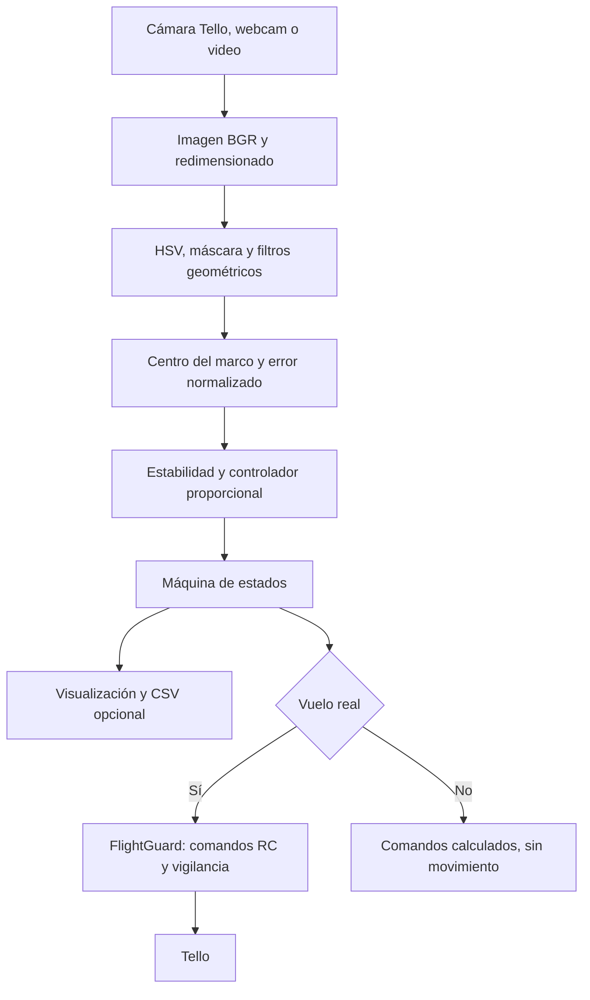

# Navegación visual de un DJI Tello mediante un marco de color

## Descripción y problema

Este proyecto implementa un prototipo en Python que utiliza imágenes de la cámara de un DJI Tello para detectar un marco azul, calcular su posición relativa y generar órdenes de movimiento. El problema abordado es la alineación visual con una abertura y el avance hacia ella mediante etapas controladas.

La solución combina segmentación HSV, filtros geométricos, un controlador proporcional y una máquina de estados. También puede procesar una webcam o un archivo de video sin mover un dron. No utiliza un modelo entrenado ni estima una trayectoria tridimensional.

**Estado actual:** `config.py` contiene `DRY_RUN = False`. Ejecutar `main.py` sin `--dry-run` ni una fuente local activa el despegue automático cuando hay video válido, batería suficiente y telemetría actualizada. No se pulsa `t` ni se espera a detectar el marco para despegar.

El programa **no confirma físicamente el cruce**. Después de haber completado un avance, perder el marco durante varias imágenes puede activar un último avance temporizado y el aterrizaje.

## Flujo general



En etapa `full`, el comportamiento actual es:

1. Despegar automáticamente tras las comprobaciones iniciales y esperar 2 segundos después de confirmar el despegue.
2. Detectar el marco y corregir posición lateral y vertical.
3. Exigir 5 detecciones consecutivas alineadas.
4. Avanzar recto durante 0.4 segundos, sin correcciones laterales ni verticales durante el pulso.
5. Detener el avance, reiniciar la confirmación y volver a alinear.
6. Si, tras haber completado algún pulso, se acumulan 3 imágenes consecutivas sin marco y no vence antes el timeout de pérdida, avanzar otros **3 segundos**.
7. Pasar a `DONE`, mantener RC cero durante 1 segundo y solicitar aterrizaje.

Los valores anteriores corresponden al código inspeccionado. El detalle de tiempos, prioridades y excepciones está en [DOCUMENTATION.md](DOCUMENTATION.md).

## Estructura del proyecto

| Ruta | Propósito |
|---|---|
| `main.py` | Argumentos de ejecución, máquina de estados, bucle principal y cierre de la misión. |
| `config.py` | Parámetros y función `validate()`. |
| `gate_detector.py` | Detección del marco, error visual y dibujo del diagnóstico. |
| `controller.py` | Control proporcional para los ejes lateral y vertical. |
| `video_source.py` | Captura y adaptación de imágenes; vigilancia y envío de órdenes al dron. |
| `hsv_calibration.py` | Ajuste interactivo de los seis límites HSV sin despegue. |
| `test.py` | Visor básico de cámara Tello; conecta al ejecutarse o importarse. No es una prueba unitaria. |
| `requirements.txt` | Dependencias externas declaradas. |
| `tests/test_detector.py` | Pruebas de detector, controlador, estados e integración; contiene expectativas antiguas. |
| `tests/test_safety.py` | Pruebas de captura, despegue y fallos con hardware simulado. |
| `tests/test_straight_cross.py` | Pruebas del ciclo de pulsos, realineación y avance final. |
| `samples/generate_sample.py` | Genera un video sintético de un marco verde. |
| `samples/README.md` | Notas existentes sobre muestras. |
| `docs/` | Documentos previos de arquitectura, calibración, fase de implementación y validación; pueden diferir del código actual. |
| `DOCUMENTATION.md` | Explicación técnica detallada de la implementación actual. |
| `.gitignore` | Excluye entorno virtual, cachés Python, CSV y videos AVI/MP4 de `samples/`. |

## Dependencias y requisitos

Dependencias declaradas exactamente en `requirements.txt`:

```text
djitellopy==2.5.0
opencv-python>=4.8,<6
numpy>=1.24,<3
```

También se usan módulos de la biblioteca estándar: `argparse`, `csv`, `dataclasses`, `enum`, `logging`, `math`, `pathlib`, `threading`, `time` y herramientas de pruebas como `unittest`.

Se necesita Python y un entorno donde puedan instalarse estas dependencias. El repositorio no declara formalmente una versión mínima de Python en metadatos de empaquetado; el entorno local inspeccionado usa Python 3.13.14. No se afirma compatibilidad verificada con todas las versiones.

Para las ventanas de cámara y calibración se necesita un escritorio con soporte GUI de OpenCV. Para vuelo o captura desde el Tello se necesita el dron y conectividad de red con él; la aplicación no configura automáticamente la conexión Wi-Fi. Webcam y video local permiten trabajar sin Tello.

## Instalación en Windows / PowerShell

Desde la carpeta del proyecto, con Python disponible:

```powershell
python -m venv .venv
.\.venv\Scripts\python.exe -m pip install -r requirements.txt
```

Si el entorno ya existe, no es necesario recrearlo. Los comandos siguientes usan directamente su ejecutable; no requieren activar el entorno. Instalar dependencias requiere acceso a su fuente de paquetes.

## Ejecución

### Primera comprobación sin vuelo

Con una webcam disponible:

```powershell
.\.venv\Scripts\python.exe main.py --webcam 0 --stage align --max-frames 200
```

Con el Tello encendido y el equipo conectado a su red:

```powershell
.\.venv\Scripts\python.exe main.py --dry-run --stage align
```

El segundo comando conecta y activa el video del Tello, pero no despega ni envía RC desde la navegación.

Para un archivo existente, sustituir la ruta del ejemplo:

```powershell
.\.venv\Scripts\python.exe main.py --video "ruta\video_del_gate.mp4" --headless --log-csv run.csv
```

`--video` y `--webcam` fuerzan siempre el modo sin vuelo, incluso con `DRY_RUN = False`. El archivo termina al llegar al final; el bucle principal no lo repite. El directorio del CSV debe existir y el archivo indicado se abre para escritura, reemplazando su contenido.

### Calibración del azul

```powershell
.\.venv\Scripts\python.exe hsv_calibration.py --webcam 0
```

Para usar el Tello, omitir `--webcam 0`; para un video, usar `--video "ruta\video.mp4"`.

Ajustar los controles hasta conservar el marco en blanco dentro de `HSV mask` y reducir el fondo. La herramienta muestra imagen original, máscara y resultado filtrado. Imprime los límites HSV; hay que copiarlos manualmente a `config.py`.

- `p`: volver a imprimir los valores.
- Espacio: pausar/reanudar fuentes locales.
- `q` o Esc: salir.
- El video local se repite en esta herramienta.
- La calibración no ejecuta `takeoff()`.

### Vuelo real y etapas

**Los siguientes comandos pueden despegar automáticamente con la configuración actual.** Primero debe existir conectividad con el Tello.

```powershell
.\.venv\Scripts\python.exe main.py --stage hover
.\.venv\Scripts\python.exe main.py --stage align
.\.venv\Scripts\python.exe main.py --stage full
```

Son alternativas para ejecuciones separadas.

| Etapa | Comportamiento |
|---|---|
| `hover` | Despega y mantiene RC cero; sigue sujeto a límites de misión y comunicación. |
| `horizontal` | Corrige únicamente izquierda/derecha. |
| `align` | Corrige lateral y verticalmente; no avanza. |
| `approach` | Se alinea y aproxima con correcciones; detiene el avance al alcanzar el umbral de ancho aparente. No ejecuta el ciclo de cruce. |
| `full` | Alineación, pulsos rectos, realineación y avance final tras pérdida del marco. Es el valor predeterminado. |

En la ventana de OpenCV, `q` o Esc solicitan parada; Ctrl+C también termina el bucle. Si hubo intento de despegue, el cierre intenta detener el movimiento y aterrizar. Cerrar la ventana principal también aborta.

### Opciones disponibles en main.py

| Opción | Función |
|---|---|
| `--video RUTA` | Leer un video local; incompatible con `--webcam`. |
| `--webcam ÍNDICE` | Leer una cámara local; incompatible con `--video`. |
| `--dry-run` | Forzar ausencia de movimiento. |
| `--stage ETAPA` | Seleccionar una etapa de la tabla anterior. |
| `--headless` | Omitir ventanas; permitido únicamente sin vuelo. |
| `--max-frames N` | Terminar después de N imágenes procesadas; 0 significa sin límite de frames. |
| `--log-csv RUTA` | Registrar estado, errores y órdenes calculadas. |
| `--help` | Mostrar ayuda del parser. |

### Muestra sintética

```powershell
.\.venv\Scripts\python.exe samples/generate_sample.py
.\.venv\Scripts\python.exe main.py --video samples/synthetic_gate.avi --headless --max-frames 100
```

El generador crea 240 imágenes de 640 × 480, a 20 FPS, con codificación MJPG. **El marco generado es verde, mientras que la configuración actual detecta azul.** Este ejemplo sirve para comprobar lectura y procesamiento, pero no se debe esperar detección positiva ni una misión completa con los valores actuales.

## Módulos y API principal

| Elemento | Responsabilidad |
|---|---|
| `GateDetection` | Resultado inmutable: detección, centro, caja, área, ancho relativo y puntuación heurística. |
| `GateDetector.detect(frame)` | Devuelve `(GateDetection, mask)`. |
| `normalized_error(detection, frame_shape)` | Calcula errores visuales respecto a una referencia horizontal y vertical. |
| `draw_debug(...)` | Devuelve una copia de la imagen con información superpuesta. |
| `PController.update(error_x, error_y)` | Devuelve las correcciones enteras `(lr, ud)`. |
| `Navigation.start/update/abort` | Inicia, actualiza y aborta la máquina de estados sin conectar hardware. |
| `Navigation.same_target(...)` | Compara salto del centro y cambio de tamaño entre detecciones. |
| `VideoSource.open/read/battery/close` | Maneja la fuente de imágenes y su cierre. |
| `FlightGuard.start/submit/close` | Envía RC periódicamente y controla la vigencia de las órdenes. |
| `FlightGuard.health_error(now)` | Revisa batería y renovación de telemetría. |
| `config.validate()` | Rechaza combinaciones y valores fuera de las restricciones implementadas. |
| `main.parse_args/run` | Interfaz de consola y coordinación de la aplicación. |

## Entradas, salidas y lógica

Las entradas son imágenes, límites de color y geometría, parámetros de control, argumentos de consola, teclas de parada y telemetría del dron.

Las salidas son:

- Ventana `Tello Gate`, máscara opcional `HSV mask` y mensajes de consola.
- CSV opcional con `time,state,detected,error_x,error_y,lr,fb,ud,yaw,width_ratio`.
- En vuelo real: `takeoff()`, `send_rc_control(lr, fb, ud, yaw)` y `land()`.

La intensidad de corrección se calcula como ganancia por error, con saturación, zona muerta y suavizado opcional. Los comandos tienen orden **lateral, avance, vertical, giro**; el giro siempre es cero en la navegación actual. Los valores RC no son distancias recorridas.

La referencia vertical actual es **`target_y = height * 0.25`**, escrita directamente en `normalized_error()`. Alinearse significa situar el centro del gate en `(W/2, H/4)`, no en el centro geométrico de la imagen. El dibujo de referencia del HUD sigue en `(W/2, H/2)`; esta discrepancia visual debe tenerse en cuenta.

## Pruebas y estado de verificación

```powershell
.\.venv\Scripts\python.exe -B -m unittest discover -s tests -v
```

En la revisión que acompaña esta documentación se ejecutaron **36 pruebas: 30 pasaron y 6 fallaron**, sin vuelo real. Los seis fallos están en `tests/test_detector.py`: dos esperan detectar marcos verdes, uno espera la antigua referencia vertical, uno espera completar la secuencia con el video verde y dos esperan estados de la navegación anterior.

Las 8 pruebas de `test_safety.py` y las 4 de `test_straight_cross.py` pasaron. Esto comprueba escenarios simulados, no garantiza el comportamiento físico ni el cruce. No se modificaron las pruebas ni el programa para elaborar esta documentación.

## Limitaciones conocidas

- No hay confirmación física del cruce, medición de distancia al gate ni prevención general de colisiones.
- La pérdida del marco puede deberse a iluminación, oclusión o salida del encuadre; aun así, después de un pulso puede activar el avance final.
- Durante `CROSS` y `FINAL_ADVANCE` no se corrige la trayectoria; reaparecer el marco no cancela el avance final.
- No reconstruye un marco incompleto ni mantiene un seguimiento visual persistente.
- Fuera de los avances temporizados, una vuelta sin imagen válida pone RC cero y reinicia el controlador. Puede haber correcciones intermitentes.
- `SEARCH` no realiza un barrido físico: espera detecciones con RC cero.
- Los pulsos no esperan confirmación de velocidad física cero antes de realinear.
- Los parámetros requieren calibración. La configuración y los logs no demuestran una distancia recorrida.
- La suite contiene expectativas desactualizadas y el generador sintético no coincide con el color actual.
- No hay recarga automática de `config.py`; guardar y reiniciar es necesario.

Consultar [DOCUMENTATION.md](DOCUMENTATION.md) para fórmulas, prioridades de estados, temporización y parámetros que permanecen en el archivo pero ya no gobiernan la maniobra.
