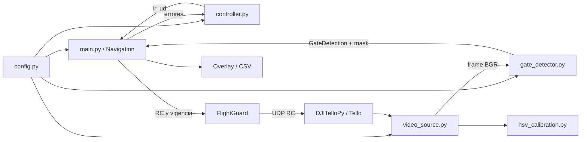
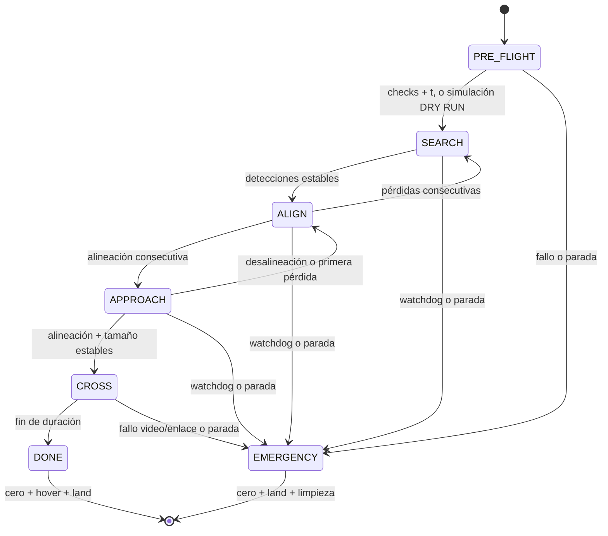

# Arquitectura

| Archivo | Responsabilidad |
|---|---|
| `main.py` | CLI, PRE_FLIGHT, `Navigation` (estados puros), visualización, armado, ciclo y `finally` |
| `gate_detector.py` | `GateDetection`, máscara HSV, filtrado geométrico, centroide, errores y overlay |
| `controller.py` | `PController.update(error_x, error_y)` devuelve `(lr, ud)` enteros saturados con EMA |
| `config.py` | Valores editables, unidades y validación previa de rangos |
| `video_source.py` | Tello/video/webcam → BGR; `FlightGuard` emite RC, vigila comunicación y aterriza |
| `hsv_calibration.py` | Captura compartida y seis trackbars; no activa vuelo |
| `tests/test_detector.py` | Geometría, control, estados, fallos, mocks y video sintético |

## Interfaces y tiempo

`GateDetector.detect(frame)` retorna `(GateDetection, mask)`. `detected=False`
indica ausencia de un candidato geométrico válido. La aceptación temporal es
independiente: `Navigation` exige `DETECTED_FRAMES` y continuidad de centro/tamaño.
El centro se obtiene con momentos del contorno exterior; no es la pose 3D ni
necesariamente el centro exacto del hueco proyectado en perspectivas extremas.

`Navigation.update(detection, frame_shape, now)` retorna `(lr, fb, ud, 0)` sin
interactuar con hardware. Contiene contadores `detected_frames`, `aligned_frames`,
`lost_frames` y `close_frames`. `now` es monotónico en vivo y tiempo del contenido
en archivo. Las decisiones sólo acumulan contadores con frames nuevos; no se
reutiliza el último frame como si fuera una observación nueva.

La captura Tello usa la cola de longitud 1 de DJITelloPy: obtiene el frame más
reciente y descarta atraso. La implementación 2.5.0 entrega RGB; se convierte a BGR
antes de OpenCV. Un tick sin frame frena fuera de CROSS sin incrementar contadores.
Si no llegan frames por `FRAME_TIMEOUT`, se aborta incluso en CROSS. El umbral
detecta ausencia de decodificación, no contenido repetido por una cámara averiada.

## Estados y protecciones

El hilo `FlightGuard` es el único emisor RC periódico, a `CONTROL_HZ`. Los comandos
tienen caducidad `COMMAND_TIMEOUT`; si OpenCV o el bucle se bloquean, el guard
intenta cero y aterrizar. La vigencia de CROSS se limita también por su fecha de
finalización. Una copia nueva del diccionario de telemetría de DJITelloPy 2.5.0
indica recepción: los valores pueden ser idénticos durante hover. Actualizar esa
dependencia requiere revisar esta suposición y la conversión de color.

El SDK `takeoff` se ejecuta en un hilo para mantener la GUI activa. Una parada
durante ascenso envía cero y espera que finalice el comando antes de `land`; no
se puede cancelar el ascenso SDK. El watchdog periódico empieza después de la
confirmación de despegue. El `finally` también intenta aterrizar si takeoff falló
sin confirmación, y limpia cada recurso aunque `streamoff()` falle.

DRY RUN no construye `FlightGuard` ni llama a takeoff/RC/land; las velocidades
existen sólo en memoria, overlay y CSV. En fuentes locales no se construye Tello.
No hay conexiones ni efectos físicos al importar módulos.

## Alcance

No hay estimación de profundidad, yaw, odometría, evitación de obstáculos ni
confirmación visual posterior al cruce. CROSS mantiene LR/UD/yaw en cero y FB
constante durante el tiempo configurado. La seguridad de entrega de paquetes UDP
y la frenada física no pueden garantizarse desde el software.
