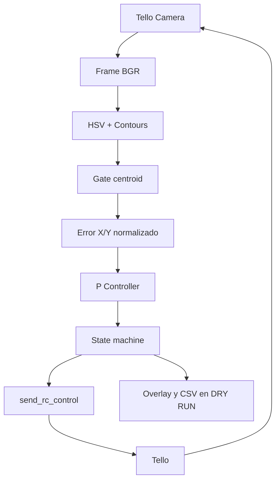

# Fase 2: implementación de navegación visual

## Implementación

Se implementó el pipeline conceptual de Fase 1 en Python con DJITelloPy y OpenCV.
El sistema obtiene video, segmenta el color del marco con HSV, filtra contornos,
calcula el centroide y obtiene errores normalizados. Un controlador proporcional
P genera correcciones laterales y verticales. Una máquina de estados decide si
mantener posición, corregir, aproximarse o ejecutar el cruce con `send_rc_control()`.
No se incorporan ROS 2, PX4, Gazebo, YOLO ni un controlador PID.

## Pipeline



El detector considera área exterior, tamaño, relación de aspecto con tolerancia
a perspectiva, rectangularidad, polígono convexo y un hueco interior. Selecciona
un candidato con puntuación geométrica; esta puntuación no es una probabilidad
ni una medición de precisión. La continuidad temporal exige detecciones consecutivas.

## Estados

- **PRE_FLIGHT:** conexión, batería, video, telemetría y armado manual antes de vuelo.
- **SEARCH:** sin gate estable, RC cero y sin búsqueda giratoria.
- **ALIGN:** corrige X/Y con avance cero; exige varios frames dentro de deadband.
- **APPROACH:** avance lento y corrección X/Y simultánea. Desalineación detiene
  avance y vuelve a ALIGN; pérdida detiene desde el primer frame y luego vuelve a SEARCH.
- **CROSS:** después de alineación y proximidad estables, avance temporizado. No
  depende de seguir viendo el marco, pero mantiene watchdog de video/telemetría.
- **DONE:** RC cero, breve hover y aterrizaje controlado.
- **EMERGENCY:** parada manual o fallo: intentar RC cero, aterrizaje y liberar recursos.

## Controlador

```text
u = Kp * e
error_x = (gate_center_x - frame_center_x) / frame_center_x
error_y = (frame_center_y - gate_center_y) / frame_center_y
```

Un error X positivo pide derecha; un error Y positivo pide arriba. El error es
independiente de resolución. Kp está expresado en unidades RC por unidad de error.
La deadband fuerza cero alrededor del centro; la saturación impide superar los
límites configurados. Una EMA pequeña suaviza el comando. Se borra memoria en
deadband, pérdida de detección y cambio de signo para evitar correcciones residuales.
El yaw permanece en cero; la aproximación y CROSS controlan el eje adelante/atrás.

## Validación

La validación progresa desde conexión/video en el piso, calibración HSV y DRY RUN,
hasta hover, control horizontal, control vertical, ALIGN, APPROACH y CROSS. Las
pruebas automatizadas no requieren hardware y usan geometría y video sintéticos.
Se debe medir en el robotario la distancia asociada al ancho aparente, latencia,
ganancias, velocidades y duración de cruce. Ninguno de los valores iniciales es
universal y no se reportan resultados experimentales no medidos.

El criterio académico final sólo se habrá demostrado cuando una prueba física
documente **detecta → alinea → aproxima → cruza → se detiene/aterriza**. Por ahora
se entrega implementación y pruebas de software; la validación física está pendiente.
